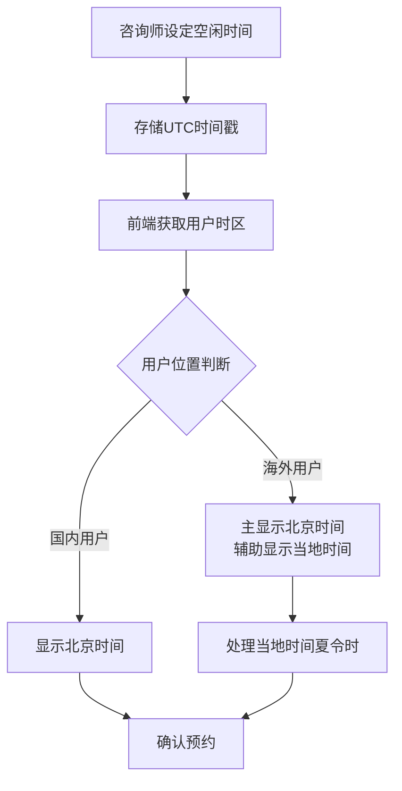
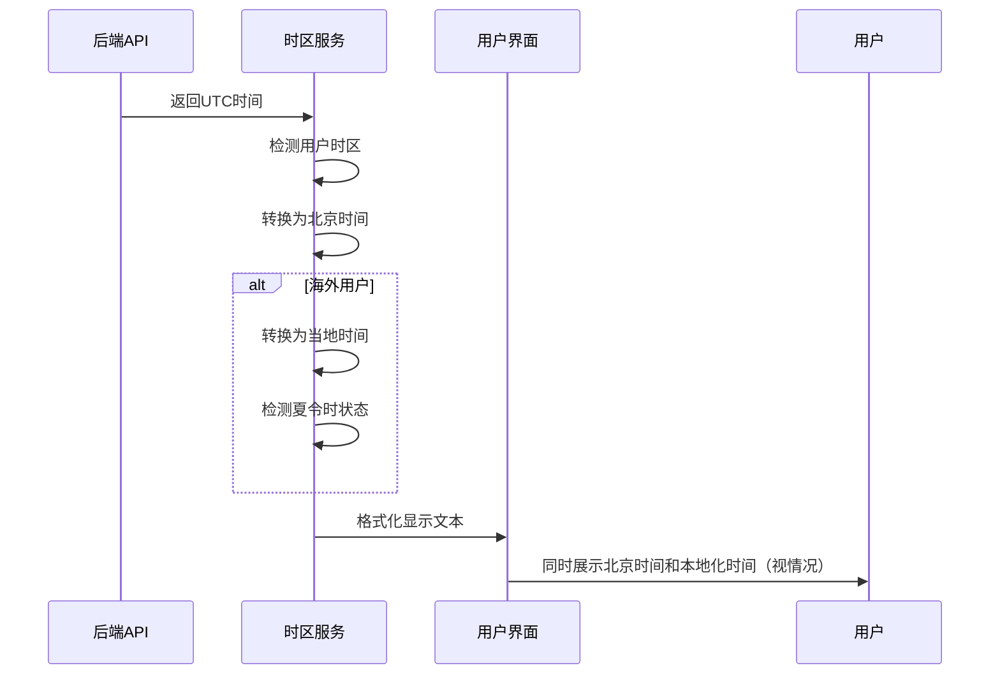

# 心理咨询时区处理方案

## 整体架构



## 后端方案

### 存储策略
- **统一时间格式**：所有时间数据以 UTC 时间戳形式存储
- **数据库设计**：时间字段使用 TIMESTAMP 类型，直接存储 UTC 时间
- **API 接口**：统一返回 UTC 时间戳

### 核心逻辑
- 接收前端传入的任何时区时间（前端也尽量传 UTC 时间戳），后端转换为 UTC 存储
- 所有时间比较和计算都基于 UTC 时间
- 向前端返回时仅提供 UTC 时间，由前端负责本地化显示

## 前端方案

### 1. 时区检测与分类

#### 用户类型识别
- **国内用户**：检测到时区为 `Asia/Shanghai`、`Asia/Beijing` 等
- **海外用户**：其他所有时区

#### 时区信息管理
- 使用浏览器原生 `Intl.DateTimeFormat` API 检测用户时区
- 获取时区偏移量和夏令时状态
- 缓存时区信息，避免重复计算

### 2. 时间显示策略

#### 国内用户显示逻辑
```
显示格式：北京时间 2024-12-25 14:00
```

#### 海外用户显示逻辑
```
主要显示：北京时间 2024-12-25 14:00
辅助显示：当地时间 2024-12-25 01:00 (纽约时间)
夏令时标记：当地时间 2024-07-25 02:00 (纽约时间·夏令时)
```

### 3. 时间转换流程



### 4. 核心服务模块

#### TimezoneService 时区服务
- **时区检测**：自动识别用户所在时区
- **时间转换**：UTC 时间与本地时间互转
- **夏令时处理**：自动识别并标记夏令时状态
- **显示格式化**：根据用户类型生成相应的时间显示文本

#### 关键功能
- `detectUserTimezone()` - 检测用户时区
- `formatDisplayTime()` - 格式化显示时间
- `convertToUTC()` - 本地时间转 UTC
- `isDaylightSavingTime()` - 夏令时判断

### 5. 用户交互设计

#### 时间选择界面
- **时区提示**：显示当前检测到的时区信息
- **时间列表**：按照显示策略展示可选时间
- **确认界面**：重点突出北京时间，辅助显示当地时间

#### 预约确认逻辑
- **国内用户**：仅确认北京时间
- **海外用户**：同时确认北京时间和当地时间，避免时区混淆

## 业务流程

### 咨询师设定空闲时间
1. 咨询师在界面选择空闲时间段
2. 前端将本地时间转换为 UTC 时间
3. 后端接收并存储 UTC 时间戳

### 来访者预约流程
1. 前端获取咨询师空闲时间（UTC）
2. 根据来访者时区进行时间转换和显示
3. 来访者选择时间后，前端转换为 UTC 提交
4. 预约确认时重点显示北京时间

### 预约提醒和通知
- **短信/邮件通知**：始终包含北京时间
- **海外用户额外显示**：当地时间作为辅助信息
- **夏令时处理**：自动调整夏令时变化对预约的影响

## 技术实现要点

### 1. 时区数据管理
- 使用 `date-fns` 等时间处理库
- 集成时区数据库，支持历史和未来的时区规则
- 缓存时区转换结果，提升性能

### 2. 夏令时处理
- 自动检测夏令时开始和结束时间
- 在时间显示中明确标记夏令时状态
- 处理夏令时切换期间的时间歧义

### 3. 用户体验优化
- **智能默认**：根据用户位置智能选择显示格式
- **清晰标识**：用不同颜色或图标区分北京时间和当地时间
- **确认提醒**：预约前再次确认时间，避免时区错误

## 异常处理

### 时区检测失败
- 默认按北京时间处理
- 提供手动时区选择选项

### 夏令时切换期间
- 明确提示时间变化
- 避免在切换时间点附近安排预约

### 网络异常
- 缓存时区设置和转换规则
- 离线状态下仍能进行基本时间转换

## 方案优势

1. **简化后端**：时间存储和处理逻辑简单清晰
2. **用户友好**：海外用户以北京时间为主，便于与国内对接
3. **避免混淆**：双时间显示降低时区理解错误
4. **自动化处理**：夏令时等复杂情况自动处理
5. **可扩展性**：未来可轻松支持更多时区和显示选项
